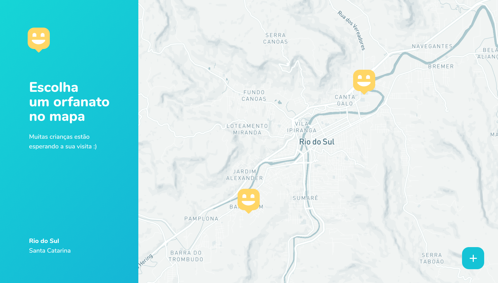
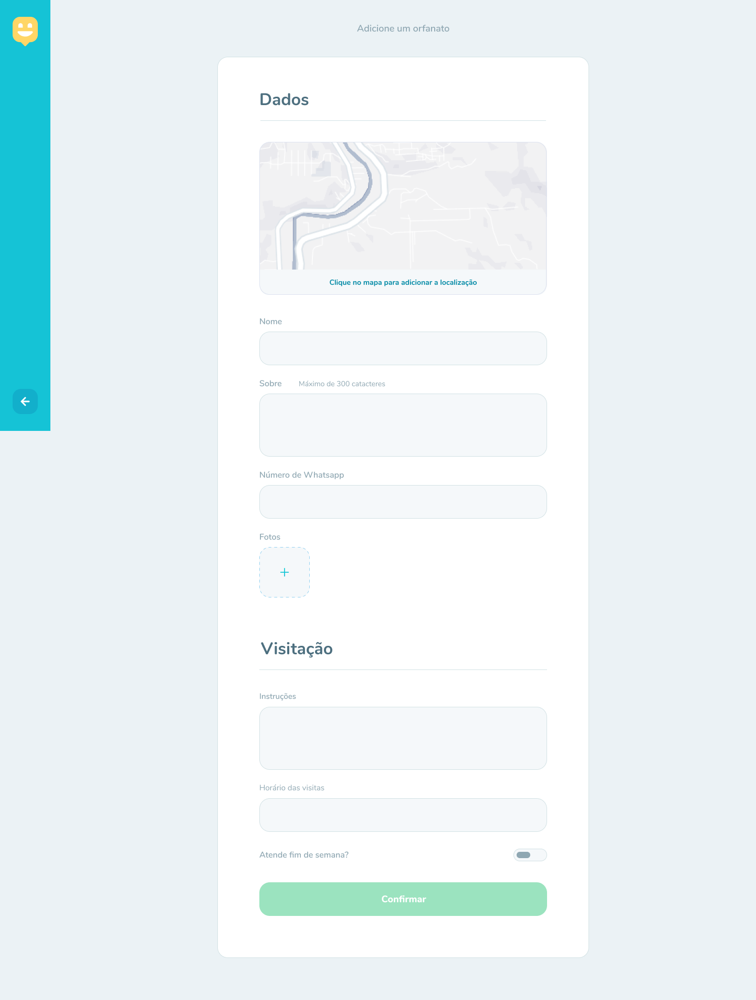
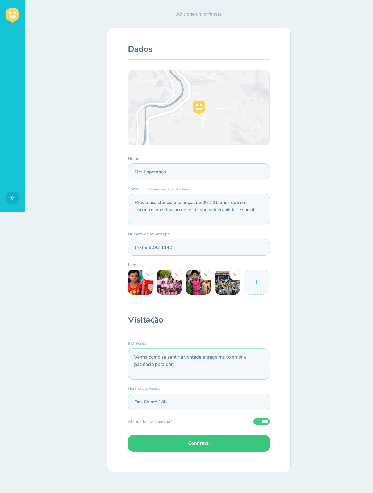
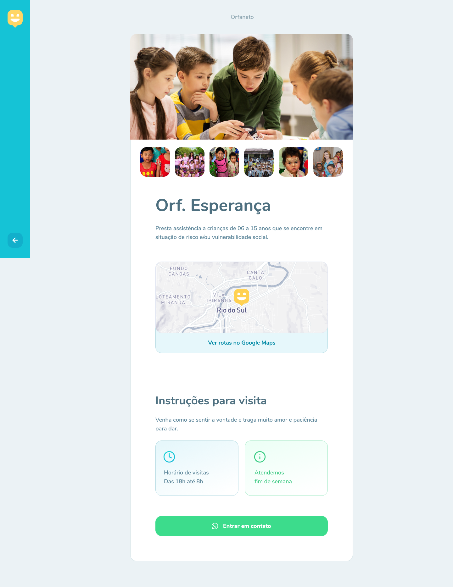

<h1 align="center">


Happy :rocket:

</h1>

<p align="center">
  Happy - Find orphanages
  <br>
  <br>

  <a href="www.linkedin.com/in/rhalfoliveira">
    
  </a>
  <a href="https://github.com/qwwerty/happy/commits/master">
    
  </a>

</p>

<p align="center">
  <a href="#dart-sobre">About</a> &#xa0; | &#xa0; 
  <a href="#rocket-tecnologias">Technologies</a> &#xa0; | &#xa0;
  <a href="#white_check_mark-requerimentos">Requirements</a> &#xa0; | &#xa0;
  <a href="#checkered_flag-começando">Starting</a> &#xa0; &#xa0; | &#xa0;
  <a href="#framed_picture-imagens">Images</a> &#xa0; &#xa0;
</p>

<br>

## :dart: About

Happy is an application that connects people to institutional care homes to make many children's days happier.

## :rocket: Technologies

The following technologies were used in the project:

- [Vite](https://vitejs.dev/)
- [NextJs 14](https://nextjs.org/)
- [Typescript](https://www.typescriptlang.org/)
- [Axios](https://axios-http.com/)
- [Radix-ui](https://www.radix-ui.com/)
- [Lucide](https://lucide.dev/)
- [React-hook-form](https://react-hook-form.com/)
- [React-toastify](https://fkhadra.github.io/react-toastify/introduction)
- [Zod](https://zod.dev/)
- [Next-themes](https://github.com/pacocoursey/next-themes)
- [Framer-motion](https://www.framer.com/motion/)
- [Leaflet](https://leafletjs.com/)
- [Tailwind](https://tailwindcss.com/)
- [Lodash](https://lodash.com/)

## :white_check_mark: Requirements

- [Node](https://nodejs.org/en/)
- [Npm](https://www.npmjs.com/)
- [Yarn](https://yarnpkg.com/lang/en/)

## :checkered_flag: Starting

```bash
# Clone this project
$ git clone https://github.com/qwwerty/happy

# Access
$ cd happy

# Install dependencies
$ npm install

# Rename the .env.example file to .env.local and configure environment variables

# Run the project
$ npm run dev

# The server will initialize in the <http://localhost:3000>
```

## :point_right: Figma

- [Figma](<https://www.figma.com/file/IvfKjdAkhV4jOKmnaOjW3D/Happy-Web-(Copy)?type=design&node-id=0%3A1&mode=dev>)

## :framed_picture: Images

<h1 align="center">
    
    
    
    
    
</h1>
